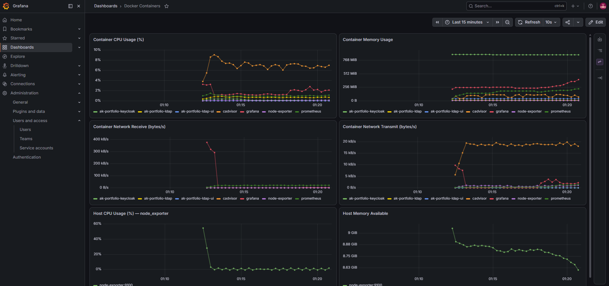

# Prometheus + Grafana Docker Monitoring Stack

A ready-to-run monitoring stack for Docker containers and the host machine, built with:

- **Prometheus** — metrics collection & storage
- **Grafana** — dashboards & visualization (pre-provisioned with a Prometheus datasource and a "Docker Containers" dashboard)
- **cAdvisor** — per-container CPU / memory / network metrics
- **node-exporter** — host-level CPU / memory / disk metrics



## Project structure

```
prometheus-grafana-monitoring/
├── docker-compose.yml
├── prometheus/
│   └── prometheus.yml          # scrape config (prometheus, node-exporter, cadvisor)
└── grafana/
    ├── provisioning/
    │   ├── datasources/
    │   │   └── datasource.yml  # auto-registers Prometheus as a datasource
    │   └── dashboards/
    │       └── dashboard.yml   # tells Grafana to load dashboards from /dashboards
    └── dashboards/
        └── docker-containers.json  # pre-built dashboard (CPU, memory, network)
```

## Prerequisites

- Docker Desktop (with Docker Compose) installed and running.

## Usage

From this folder, start the stack:

```powershell
docker compose up -d
```

Check everything is running:

```powershell
docker compose ps
```

### Access the services

| Service     | URL                          | Notes                          |
|-------------|-------------------------------|---------------------------------|
| Grafana     | http://localhost:3002        | login `admin` / `admin` (change on first login) — moved from 3000, kept free for another local app |
| Prometheus  | http://localhost:9090        | query UI / targets page at `/targets` |
| cAdvisor    | http://localhost:8082        | raw container metrics UI (moved from 8080 — that port was already used by another local container) |
| node-exporter | http://localhost:9100/metrics | raw host metrics |

Grafana already has the **Prometheus** datasource and the **Docker Containers** dashboard provisioned — just log in and open it from the Dashboards list.

### Stopping / cleaning up

```powershell
docker compose down          # stop and remove containers
docker compose down -v       # also wipe Prometheus/Grafana stored data
```

## Adding more targets

Edit `prometheus/prometheus.yml` and add a new entry under `scrape_configs`, e.g. to monitor your own app:

```yaml
  - job_name: "my-app"
    static_configs:
      - targets: ["my-app:8000"]
```

Then reload Prometheus without restarting the container:

```powershell
curl -X POST http://localhost:9090/-/reload
```

## Customizing Grafana credentials

Set your own admin password by editing the `grafana` service environment in `docker-compose.yml`:

```yaml
    environment:
      - GF_SECURITY_ADMIN_USER=admin
      - GF_SECURITY_ADMIN_PASSWORD=change-me
```

## Notes

- cAdvisor mounts host paths (`/`, `/var/run`, `/sys`, `/var/lib/docker`) read-only to inspect running containers. This works out of the box with Docker Desktop's Linux VM backend on Windows.
- cAdvisor is published on host port `8082` (not the default `8080`) because another local container (`ak-portfolio-keycloak`) was already bound to `8080` on this machine. Change it back in `docker-compose.yml` if that's no longer the case for you.
- All data is persisted in named Docker volumes (`prometheus_data`, `grafana_data`) so metrics/dashboards survive container restarts.
